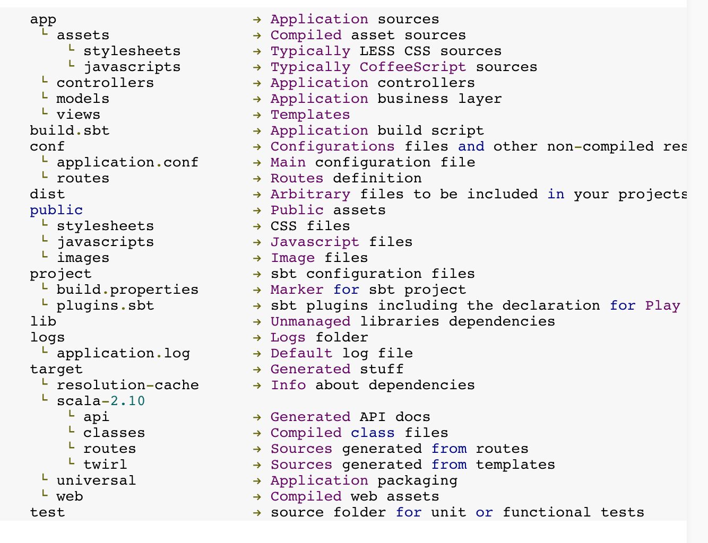

###Play应用的布局
Play应用的布局是以尽可能保持简单作为第一准则的，创建应用并且第一次编译成功后，一个play应用的结构大体上是这样的：

###app/目录
*app*目录包含了所有可执行的构件：Java和Scala源代码，模板，和编译过的资源文件。

这个目录有三个包，分别对应MVC模式的三层。

1. app/controllers
2. app/models
3. app/views

当然你也可以增加自己的包，例如*app/utils*包。

注意，在Play框架中，controller、model、view的包名都是按照约定的，如果需要是可以更改的，例如把包名都加上类似 com.yourcompany 的前缀。

还有一个可选的目录 app/assets 可以用来存放如LESS或者CoffeeScript等前端源码的。

###public/目录

public目录下存放的是可以被web服务器直接处理的静态资源。

这个目录下有三个字目录，分别用来存放图片、CSS样式和Javascript文件。你应该保持类似的文件组织风格。

在我们刚刚创建的应用里， /public目录被映射到/assets这个URL，但是你其实可以很容易的修改它，甚至用好几个目录来存放静态资源都是可以的。

###conf/目录
conf目录包含了应用的配置文件，主要有两个：
1. application.conf,这个是应用的主配置文件，包含了一系列配置参数。
2. routes, 这个是url映射定义文件。

如果你需要针对你的应用增加特定的配置参数，最好就是在application.conf文件中加。

如果一个类库需要一个特定配置文件，最好也是把它放在conf目录下。

###lib/目录
lib目录是可选的，它包含所有未被管理的依赖库，例如所有你想在构建系统之外自己手动管理的jar包。把任何你需要的jar包拖到这个目录，它们就会被添加到应用的classpath。

