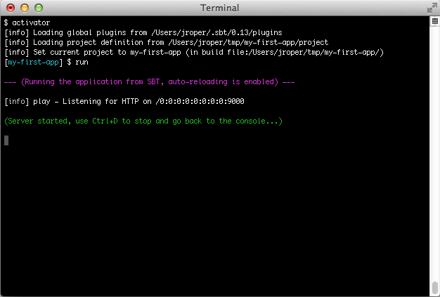
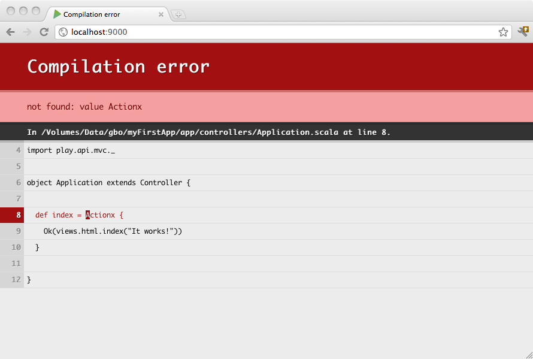
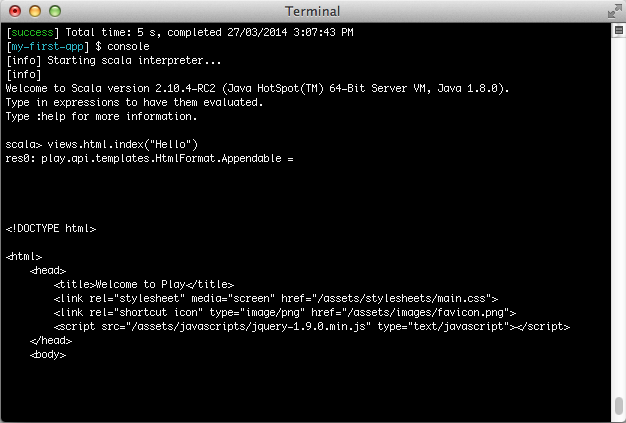

###启动控制台
Play 控制台是一个基于 sbt 的开发控制台，通过它，你可以整个应用开发周期内很好地进行管理。

要启动 Play 控制台的话，先进入项目所在目录，接着运行 Activator

	$ cd my-first-app
	$ activator

###获得帮助
在控制台 shell 环境中执行 help 命令，就可以得到所有可用命令的基本帮助信息。执行 help 的时候，
你也可以附加上一个特定的命令，这样就可以查看这个特定命令的帮助信息。
	[my-first-app] $ help run

###在开发模式下启动服务
要在开发模式下启动服务，需要执行 run 命令
	[my-first-app] $ run

在开发模式下，自动重新装载的特性就被启用了，也就是说，对于每一个请求，Play 框架都会检查你的项目，并且重新编译修改过的代码。

如果需要的话，应用也可能自动重启。

如果有编译错误发生，编译错误的信息就会直接输出到浏览器页面上。

按*Ctrl+D*停止服务，返回控制台。

###编译
你可以直接编译你的应用，不一定非要启动服务。只需要使用 compile 命令即可。
	[my-first-app] $ compile

###执行测试用例
就行上面的命令，你也可以直接运行测试用例，而不必启动应用，使用 test 命令即可。
	[my-first-app] $ test

###启动交互模式控制台
输入 console 命令，就可以进入交互模式的 scala 控制台，在这里你可以交互式的测试你的代码。
	[my-first-app] $ console
要在 scala 控制台里启动应用（例如访问数据库），执行如下命令
	bash scala> new play.core.StaticApplication(new java.io.File("."))

###调试
在启动控制台的时候，你可以让 Play 框架启动一个 JPDA 调试端口，然后就可以用 Java Debugger 连接调试。
命令是
	$ activator -jvm-debug 9999
当 JPDA 端口打开后，JVM在应用启动的时候会打印一行日志。如下所示。
	Listening for transport dt_socket at address: 9999
###使用 sbt 的功能
Play控制台就是一个普通的 sbt 控制台，所以你可以放心地使用 sbt 有的那些功能，比如说*triggered execution*。
使用 ~ compile
	[my-first-app] $ ~ compile
这样你每一次修改源程序，编译就会被触发。

如果你使用 ~ run，
这样当开发服务器在运行中的时候，触发性编译就会被启用。

同样的道理，如果你执行 ~ test，这样每次你修改源程序的时候都会执行测试用例。

###直接使用 play 框架的命令
你也可以在不进入控制台的情况下直接执行命令，例如输入 *activator run*

	$ activator run
	[info] Loading project definition from /Users/jroper/tmp/my-first-app/project
	[info] Set current project to my-first-app (in build file:/Users/jroper/tmp/my-first-app/)
	
	--- (Running the application from SBT, auto-reloading is enabled) ---
	
	[info] play - Listening for HTTP on /0:0:0:0:0:0:0:0:9000
	
	(Server started, use Ctrl+D to stop and go back to the console...)
	The application starts directly. When you quit the server using Ctrl+D, you will come back to your OS prompt. Of course, the triggered execution is available here as well:
	
	$ activator ~run

