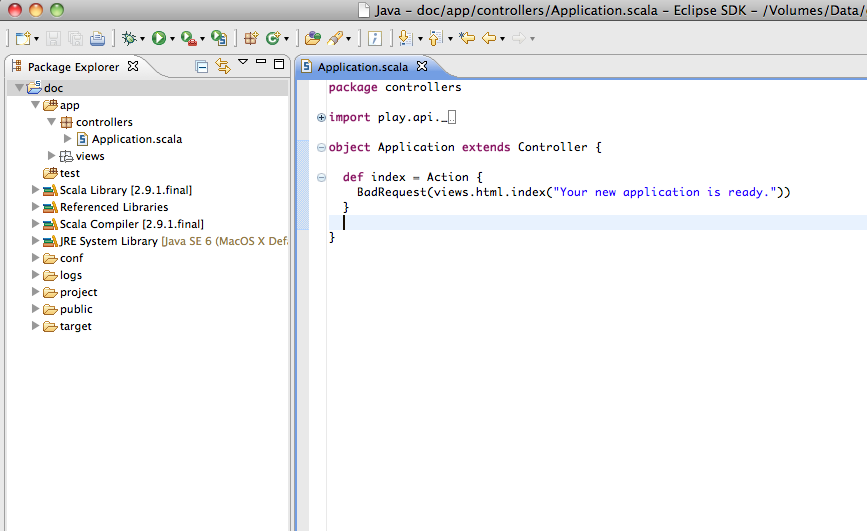

使用 Play 框架是很容易的，你甚至不需要一个复杂的IDE，因为框架会自动编译更新你对源代码所做的修改工作，所以你可以使用一个简单的稳本编辑器来工作。
但是毕竟使用一个更加现代化的 Java 或者 Scala IDE 可以提供给你更多强大的功能，例如代码的自动完成，即时编译，方便的重构和调试等。

###Eclipse
####安装sbteclipse
Play 框架要求 sbteclipse 的版本不低于4.0.0
	addSbtPlugin("com.typesafe.sbteclipse" % "sbteclipse-plugin" % "4.0.0")
运行 eclipse 命令之前你必须先编译工程。加上下面这行配置，你就可以强制当 eclipse 命令执行时自动编译。
	// Compile the project before generating Eclipse files, so that generated .scala or .class files for views and routes are present
	EclipseKeys.preTasks := Seq(compile in Compile)
如果你的项目中存在 Scala 代码，那么你就需要安装 [Scala IDE](http://scala-ide.org/)。
如果你不想安装 Scala IDE 并且你的项目中只有 Java 代码，那么你可以做如下的设置。
	EclipseKeys.projectFlavor := EclipseProjectFlavor.Java           // Java project. Don't expect Scala IDE
	EclipseKeys.createSrc := EclipseCreateSrc.ValueSet(EclipseCreateSrc.ManagedClasses, EclipseCreateSrc.ManagedResources)  // Use .class files instead of generated .scala files for views and routes 
####生成配置
Play 框架提供了一个命令来简化 Eclipse 的配置。要把一个 Play 应用转换成一个 eclipse 工程，你需要执行 Play 命令: eclipse。
	[my-first-app] $ eclipse
如果你还想拉取可用的源码jar包（这可能会花挺长的时间并且有些源码是缺失的），请执行：
	[my-first-app] $ eclipse with-source=true
请注意如果你正在集成子项目，那么你需要在 build.sbt 适当位置设置 skipParents，向下面这样
	EclipseKeys.skipParents in ThisBuild := false
或者在 play 控制台输入
	[my-first-app] $ eclipse skip-parents=false
然后你就可以通过 Eclipse 的 Import 功能来导入项目了。

要启动调试，用*activator -jvm-debug 9999 run*启动，在 eclipse 中右键点击项目，在弹出的菜单中选择* Debug As, Debug Configurations *，
在调试配置窗口，点击 *Remote Java Application *，选择 *New*，把端口修改成9999,点击 *Apply*，之后你就可以点击 Debug 来连接正在运行的应用了。
停止调试会话并不会停止服务器。

如果你对项目做了某些重要改动，例如改了 classpath，就再使用 eclipse 命令重新生成配置文件。

提示：当你在一个团队中工作时，不要提交自己的 eclipse 配置文件到版本库中。

生成的配置文件中包含着你框架安装的绝对路径，这些路径是你机器特定的，别人不一定是一样的配置，所以当你在一个团队中工作时，务必保持 eclipse 配置文件的私有化。

###IntelliJ
[Intellij IDEA](https://www.jetbrains.com/idea/)让你可以不用任何命令就可以快速生成一个 Play 应用。除了这个 IDE 本身之外，你不需要再配置任何别的东西，SBT工具会帮你下载合适的类库，解决依赖问题并构建项目。

开始使用Intellij创建play应用之前，要先确保你已经下载安装并且启用了[Scala插件](http://www.jetbrains.com/idea/features/scala.html)，就算你不用Scala语言开发，这个插件也可以帮你解决模板引擎的问题和依赖的问题。

要创建Play应用，
1. 点击 *New Project* 向导，依次选择 *Scala* -> *Play 2.x* -> *Next*
2. 输入你的项目信息，点击*Finish*

Intellij IDEA会使用SBT创建一个空的play应用。
